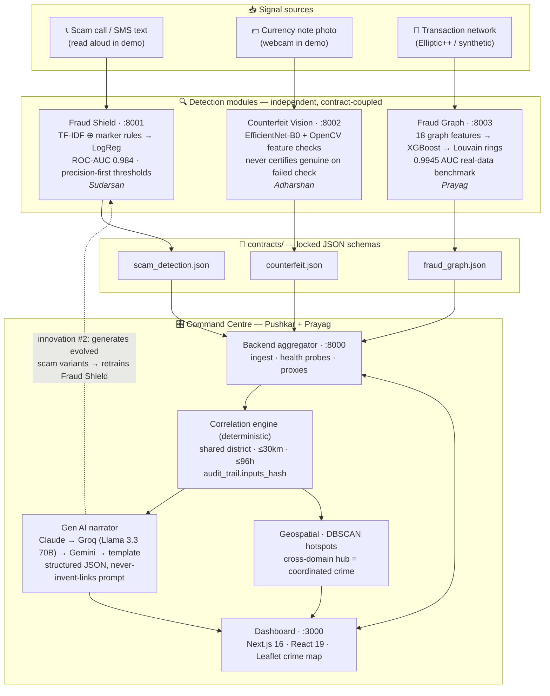
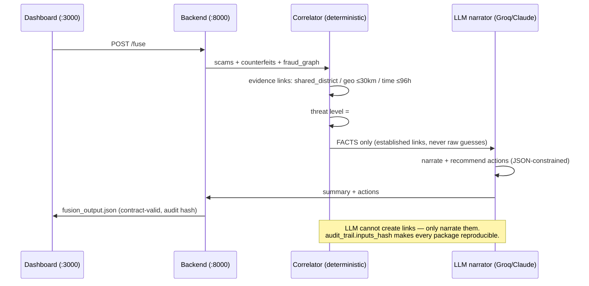

# 🏛️ Aegis — System Architecture

> Expected deliverable: architecture diagram. This renders natively on GitHub (Mermaid).
> Export to PNG for the deck via https://mermaid.live if needed.

## Full-system view

## The fusion pipeline (innovation #1)

## Why this architecture wins the judged criteria

| Criterion | Architectural answer |
|---|---|
| **Innovation** | Fusion of 3 independent detectors; deterministic-evidence + LLM-narration split; cross-domain DBSCAN hubs; LLM red-team self-improvement loop |
| **Auditability / legal admissibility** | Marker evidence spans (NLP), per-feature check scores (CV), feature importances (graph), correlation basis + reproducible `inputs_hash` (fusion) |
| **Low false positives** | Every module thresholds precision-first from its PR curve; `legit`/`genuine` verdicts are excluded from correlation entirely |
| **Scalability** | Modules are independent services speaking versioned JSON contracts — swap any model without touching the rest |
| **Resilience (demo!)** | LLM failover chain ends in a deterministic template; dashboard degrades gracefully per-module |

## Port map

| Service | Port | Owner |
|---|---|---|
| Fraud Shield API + chat UI | 8001 | Sudarsan |
| Counterfeit Vision API + camera UI | 8002 | Adharshan |
| Fraud Graph API | 8003 | Prayag |
| Command-centre backend | 8000 | Pushkar/Prayag |
| Dashboard (Next.js) | 3000 | Pushkar/Prayag |
